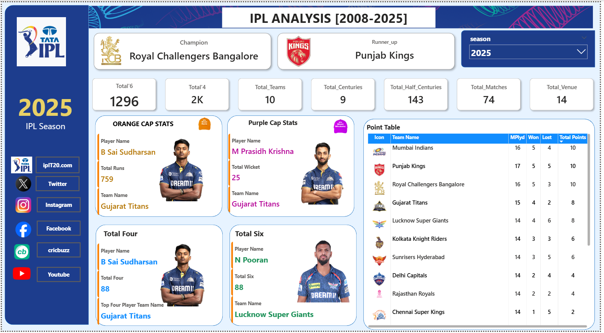

# 🏏 IPL Analysis Dashboard (2008–2025)

 

## 📌 Project Overview  
This project is an **IPL Analysis Dashboard** built using **Power BI** with datasets in **Excel/CSV format**.  
It provides insights into team and player performances from **2008 to 2025**, covering Orange Cap, Purple Cap, most fours, most sixes, and overall team standings.

---

## 📂 Project Files  
- `IPL_Dashboard.pbix` → Power BI file of the dashboard  
- `Teams_data.csv` → Team-wise performance dataset  
- `Players_data.csv` → Player statistics dataset  
- `IPL_Matches_data.csv` → Match-level data  
- `Dashboard_preview.png` → Screenshot of the final dashboard  
- `Logos.png` → Images of the logos used in the dashboard 
---

## 📊 Dashboard Features  

- **Season Analysis (2008–2025)**  
- **Champion & Runner-up Teams**  
- **Orange Cap Stats** – Top run-scorer (e.g., B Sai Sudharsan – 759 runs, 2025)  
- **Purple Cap Stats** – Top wicket-taker (e.g., Prasidh Krishna – 25 wickets, 2025)  
- **Total Fours & Sixes Leaders**  
- **Seasonal Match Insights** – Matches played, venues, centuries, and half-centuries  
- **Points Table** – Matches played, won/lost, and total points  

---

## 📈 Key Insights from 2025 Season  

- **Champion:** Royal Challengers Bangalore 🏆  
- **Runner-up:** Punjab Kings  
- **Orange Cap (Most Runs):** B Sai Sudharsan – *759 Runs* (Gujarat Titans)  
- **Purple Cap (Most Wickets):** M Prasidh Krishna – *25 Wickets* (Gujarat Titans)  
- **Most Fours:** B Sai Sudharsan – *88 Fours*  
- **Most Sixes:** N Pooran – *88 Sixes* (Lucknow Super Giants)  

---

## 🛠️ Tools & Technologies  

- **Power BI** → Dashboard creation & data visualization  
- **Excel / CSV** → Data storage and preprocessing  
- **DAX** → Measures and KPIs  
- **Data Modeling** → Relationship building between teams, players, and match datasets  

---

## 📢 Insights for Analysts

This dashboard is helpful for:

- **Sports Analysts –** Reviewing player and team performance trends
- **Fans & Enthusiasts –** Exploring season-wise records
- **Data Analysts –**  Learning Power BI visualization and DAX techniques

## 📬 Connect with Me

**Aadarsh Jaiswal**  
🔗 [Portfolio](https://aadarshjaiswalvns.github.io/Data-Analytics-Portfolio)  
💼 [LinkedIn](https://www.linkedin.com/in/aadarsh-jaiswal/)  
📧 [Email](mailto:aadarshjaiswal.vns@gmail.com)

---

> If you like this project, consider giving it a ⭐ to support my work!

